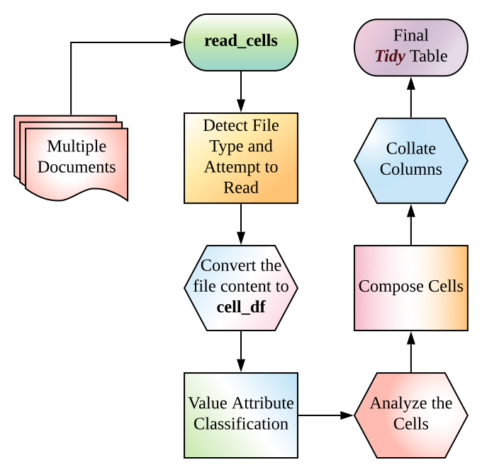
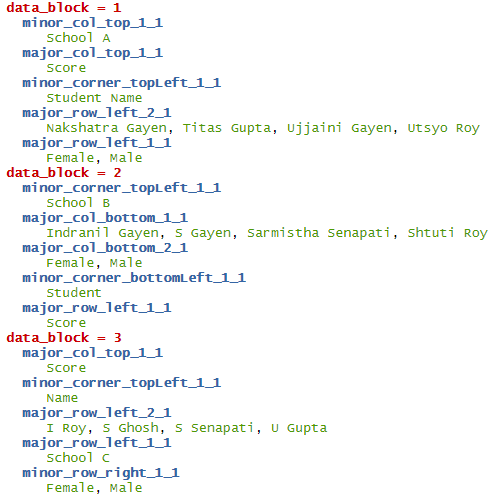
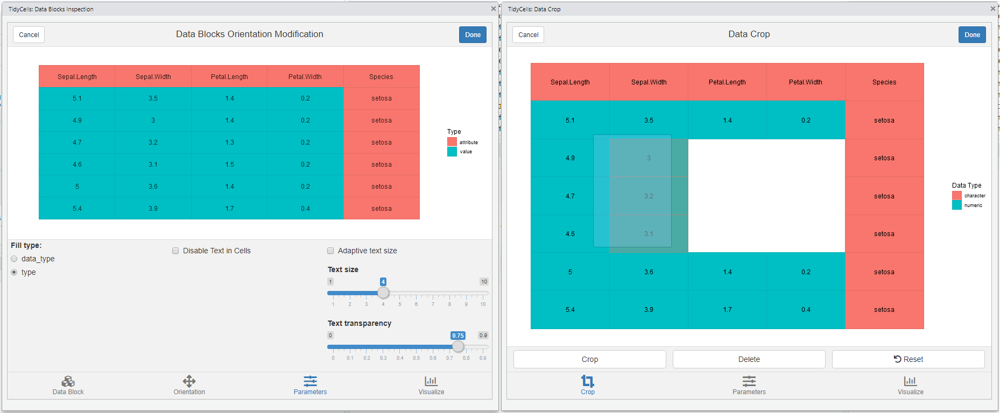
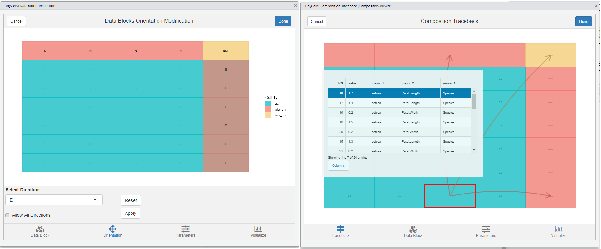

```{r, include = FALSE}
knitr::opts_chunk$set(
  collapse = TRUE,
  comment = "#>"
)
```

```{r setup, include = FALSE}
library(tidycells)
```

# **tidycells** 

#### _Read Tabular Data from Diverse Sources and Easily Make Them Tidy_

<!-- badges: start -->

```{r, echo = FALSE}
# following given low res raster image
# as https://tinyverse.netlify.com/badge/tidycells pointing to 
# https://img.shields.io/badge/dependencies-9/43-orange.png?style=flat not 
# https://img.shields.io/badge/dependencies-9/43-orange.svg
# [](https://CRAN.R-project.org/package=tidycells)

# try to convert url from .png to .svg
# but it will correspond to last CRAN version only
# x <- curlGetHeaders("https://tinyverse.netlify.com/badge/tidycells")
# tg <- which(stringr::str_detect(x, "img.shields.io")) %>% min()

depi <- as.vector(read.dcf('DESCRIPTION')[, 'Imports'])
imps <- stringr::str_split(depi, ",")[[1]] %>% stringr::str_extract("[a-zA-Z0-9]+")

deps <- as.vector(read.dcf('DESCRIPTION')[, 'Suggests'])
sugg <- stringr::str_split(deps, ",")[[1]] %>% stringr::str_extract("[a-zA-Z0-9]+")

x <- installed.packages()
# for inclusion of base and recommended pkgs
usr_pkgs <- x %>% tibble::as_tibble() %>% dplyr::mutate(pkg = row.names(x)) %>% dplyr::filter(is.na(Priority)) %>% dplyr::pull(pkg)

# excluding only base
# usr_pkgs <- x %>% tibble::as_tibble() %>% dplyr::mutate(pkg = row.names(x)) %>% dplyr::filter(Priority == "base") %>% dplyr::pull(pkg)

imps <- intersect(imps, usr_pkgs)
sugg <- intersect(sugg, usr_pkgs)

dep_str <- paste0(length(imps),"/",(length(imps)+length(sugg)))

```

[](https://cran.r-project.org/package=tidycells)
[](https://cran.r-project.org/web/checks/check_results_tidycells.html)
[](https://travis-ci.org/r-rudra/tidycells)
[](https://ci.appveyor.com/project/bedantaguru/tidycells)
[](https://github.com/r-rudra/tidycells/blob/master/dev-notes.md#all-r-hub-build-summary)
[](https://www.repostatus.org/#active)
[](https://codecov.io/gh/r-rudra/tidycells?branch=master)
[](https://coveralls.io/github/r-rudra/tidycells?branch=master)
[](https://www.tidyverse.org/lifecycle/#maturing)
[](https://CRAN.R-project.org/package=tidycells)
[](https://raw.githubusercontent.com/r-rudra/tidycells/master/LICENSE.md)
[](https://github.com/r-rudra/tidycells/blob/master/dev-notes.md)


[](https://circleci.com/gh/r-rudra/tidycells)
[](https://github.com/r-rudra/tidycells/actions)
<!-- badges: end -->

## Author

[Indranil Gayen](https://orcid.org/0000-0003-0197-1944)

## TL;DR 
Given a `file_name` which is a path of a file that contains table(s). Run this `read_cells()` in the R-console to see whether support is present for the file type. If support is present, just run
```{r, eval=FALSE}
read_cells(file_name)
```

**Note** 

* Just start with a small file, as heuristic-algorithm are not well-optimized (yet).
* If the target table has numerical values as data and text as their attribute (identifier of the data elements), straight forward method is sufficient in the majority of situations. Otherwise, you may need to utilize other functions. 

**A Word of Warning** : 

_Many functions in this package are heuristic-algorithm based. Thus, outcomes may be unexpected. I recommend you to try `read_cells` on the target file. If the outcome is what you are expecting, it is fine. If not try again with `read_cells(file_name, at_level = "compose")`. If after that also the output is not as expected then other functions are required to be used. At that time start again with `read_cells(file_name, at_level = "make_cells")` and proceed to further functions._


## Introduction
The package provides utilities to read, cells from complex tabular data and heuristic detection based 'structural assignment' of those cells to a columnar or tidy format. 

Read functionality has the ability to read (in a unified manner) structured, partially structured or unstructured tabular data (usually spreadsheets for public data dissemination and aimed for common human understanding) from various types of documents. The tabular information is read as cells.
The 'structure assignment' functionality has both supervised and unsupervised way of assigning cells data to columnar/tidy format. Multiple disconnected blocks of tables in a single sheet are also handled appropriately.

These tools are suitable for unattended conversation of (maybe a pile of) messy tables (like government data) into a consumable format(usable for further analysis and data wrangling).


## Installation

Install the [CRAN](https://CRAN.R-project.org/package=tidycells) version:

```{r, echo = TRUE, eval = FALSE}
install.packages("tidycells")
```

To install the development version from GitHub you'll need `remotes` package in R (comes with `devtools`).
Assuming you have `remotes` you can install this package in R with the following command:
```{r, echo = TRUE, eval = FALSE}
# devtools::install_github is actually remotes::install_github
remotes::install_github("r-rudra/tidycells")
```

To start with `tidycells`, I invite you to see `vignette("tidycells-intro")` or check out [tidycells-website](https://r-rudra.github.io/tidycells/) (_to see vignette you need to install the package with vignette. That can be done in above command (`remotes::install_github`) by specifying `build_vignettes = TRUE`. Note that, it might be time consuming. CRAN version comes with prebuilt-vignette_).

## Quick Overview

Let's take a quick look at an example data as given in 

```{r, eval=FALSE}
system.file("extdata", "marks.xlsx", package = "tidycells", mustWork = TRUE)
```

The data looks like (in excel)

```{r, out.width = "451px", echo=FALSE, eval=TRUE, dpi=300}
knitr::include_graphics("vignettes/ext/marks.png")
```

Let's try `tidycells` functions in this data

Read at once

```{r, eval=FALSE}
# you should have tidyxl installed
system.file("extdata", "marks.xlsx", package = "tidycells", mustWork = TRUE) %>% 
  read_cells()
```
```{r, echo=FALSE}
if(rlang::is_installed("tidyxl")){
  system.file("extdata", "marks.xlsx", package = "tidycells", mustWork = TRUE) %>% 
    read_cells() %>% 
    knitr::kable()
}
```


The function `read_cells` is a set of ordered operations connected together. The flowchart of `read_cells`:

```{r, out.width = "356px", echo=FALSE, fig.align='center', dpi=300}

```

Let's understand step by step procedures followed by `read_cells`. 

```{r, eval=FALSE}
# if you have tidyxl installed
d <- system.file("extdata", "marks.xlsx", package = "tidycells", mustWork = TRUE) %>% 
  read_cells(at_level = "make_cells") %>% 
  .[[1]]
```

Or

```{r}
# or you may do
d <- system.file("extdata", "marks_cells.rds", package = "tidycells", mustWork = TRUE) %>% 
  readRDS()
```

Then 

```{r}
d <- numeric_values_classifier(d)
da <- analyze_cells(d)
```

After this you need to run `compose_cells` (with argument `print_attribute_overview = TRUE`)

```{r, echo=TRUE, eval=FALSE}
dc <- compose_cells(da, print_attribute_overview = TRUE)
```
```{r, out.width = "451px", echo=FALSE, eval=TRUE, dpi=300}

dc <- compose_cells(da)
```

If you want a well-aligned columns then you may like to do

```{r}
# bit tricky and tedious unless you do print_attribute_overview = TRUE in above line
dcfine <- dc %>% 
  dplyr::mutate(name = dplyr::case_when(
    data_block == 1 ~ major_row_left_2_1,
    data_block == 2 ~ major_col_bottom_1_1,
    data_block == 3 ~ major_row_left_1_1
  ),
  sex = dplyr::case_when(
    data_block == 1 ~ major_row_left_1_1,
    data_block == 2 ~ major_col_bottom_2_1,
    data_block == 3 ~ minor_row_right_1_1
  ),
  school = dplyr::case_when(
    data_block == 1 ~ minor_col_top_1_1,
    data_block == 2 ~ minor_corner_topLeft_1_1,
    data_block == 3 ~ minor_col_top_1_1
  )) %>% 
  dplyr::select(school,sex, name, value)

```

`head(dcfine)` looks like

```{r, echo=FALSE}
knitr::kable(head(dcfine), align = c(rep("l", 3), "c"))
```

This is still not good right! You had to manually pick some weird column-names and spent some time and energy (when it was evident from data which columns should be aligned with whom). 

The `collate_columns` functions does exactly this for you. So instead of manually picking column-names after _compose cells_ you can simply run

```{r, eval=FALSE}
# collate_columns(dc) should be same with 
# direct read_cells() result except table_tag column
collate_columns(dc) %>% 
  head()
```
```{r, echo=FALSE}
knitr::kable(head(collate_columns(dc)), align = c(rep("l", 5), "c"))
```

Looks like staged example! Yes, you are right this is not always perfect (same is true for `analyze_cells` also). However, if the data is somehow helpful in demystifying underlying columns structure (like this one), then this will be useful. 

These functions `read_cells` (all functionalities combined), `analyze_cells`, `collate_columns` are here to ease your pain in data wrangling and reading from various sources. It may not be full-proof solution to all types of tabular data. It is always recommended to perform these tasks manually whenever expected results are not coming. 


### Plots and Interactive Modules
The package provides `ggplot` based plots and `shiny` based interactive visualisations for understanding how the heuristic is functioning and also provides object (like `cell-df` or `cell-analysis`) editing capabilities. 

The [shiny](https://shiny.rstudio.com/) package is required for interactive modules. Most of the features are self-explanatory and guided. 

Check out interactive documentation of any of these functions listed below. All of these functions are available as [RStudio Addins](https://rstudio.github.io/rstudioaddins/).

Here are screenshots of each interactive widgets. 

1. Plot tune (part of all modules)
2. `visual_crop()` for data crop and deletion of sections

```{r, out.width = "516px", echo=FALSE, dpi=300}

```

3. `visual_va_classify()` for interactive VA classification
4. `visual_data_block_inspection()` this shows how the heuristic has performed the analysis after `analyze_cells`

```{r, out.width = "516px", echo=FALSE, dpi=300}
knitr::include_graphics("vignettes/ext/v34.png")
```

5. `visual_orientation_modification()` for modification to heuristic based results
6. `visual_traceback()` this is for observing how the original data is composed to form the final output. (`compose_cells` is called internally)

```{r, out.width = "516px", echo=FALSE, dpi=300}

```

For each of these modules, there is a dynamic plot option available from [plotly](https://github.com/ropensci/plotly). If you have that package, the corresponding tab will be activated. 
Since all of these modules are entirely optional the dependency is kept at **tidycells** 'suggests' level only. 


## Reference and Related Projects
* [tidyxl](https://github.com/nacnudus/tidyxl):  **Read Untidy Excel Files:**
Imports non-tabular from Excel files into R. Exposes cell content, position and formatting in a tidy structure for further manipulation. Tokenizes Excel formulas. Supports '.xlsx' and '.xlsm' via the embedded 'RapidXML' C++ library <http://rapidxml.sourceforge.net>. Does not support '.xlsb' or '.xls'.
* [unpivotr](https://github.com/nacnudus/unpivotr): **Unpivot Complex and Irregular Data Layouts**
Tools for converting data from complex or irregular layouts to a columnar structure. For example, tables with multilevel column or row headers, or spreadsheets. Header and data cells are selected by their contents and position, as well as formatting and comments where available, and are associated with one other by their proximity in given directions. Functions for data frames and HTML tables are provided.
Major parts of the package right now fully depend on **unpivotr**. The **tidycells** package would have never existed without this wonderful package from [Duncan Garmonsway](https://github.com/nacnudus).
* The [rsheets](https://github.com/rsheets) project: 
It hosts several R packages (few of them are in CRAN already) which are in the early stages of importing spreadsheets from Excel and Google Sheets into R.  Specifically, have a look at these projects which seems closely related to these projects : [jailbreaker](https://github.com/rsheets/jailbreakr), [rexcel](https://github.com/rsheets/rexcel) (README of this project has a wonderful reference for excel integration with R).
* [readabs](https://github.com/MattCowgill/readabs): **Download and Tidy Time Series Data from the Australian Bureau of Statistics**
The `readabs` package helps you easily download, import, and tidy time series data from the [Australian Bureau of Statistics](https://www.abs.gov.au/) from within R. This saves you time manually downloading and tediously tidying time series data and allows you to spend more time on your analysis.
* [ezpickr](https://CRAN.R-project.org/package=ezpickr): **Easy Data Import Using GUI File Picker and Seamless Communication Between an Excel and R**
Gives ability for choosing any rectangular data file using interactive GUI dialog box, and seamlessly manipulating tidy data between an 'Excel' window and R session.
* The [tidyABS](https://github.com/ianmoran11/tidyABS) package: 
The `tidyABS` package converts ABS excel tables to tidy data frames. It uses rules-of-thumb to determine the structure of excel tables, however it sometimes requires pointers from the user. This package is in early development.
* The [hypoparsr](https://github.com/tdoehmen/hypoparsr) package:
This package takes a different approach to CSV parsing by creating different parsing hypotheses for a given file and ranking them based on data quality features.


## Acknowledgement
This package incomplete without following packages (apart from the **unpivotr** which is the core package on which **tidycells** depends largely, as mentioned above). Each of these packages are in suggests fields of `tidycells`.
(The read_cells basically, performs unification on several functions from various packages to give you support for different file types. These are listed below.)

* [**readr**](https://cran.r-project.org/package=readr): for csv (in melted format)
* [**readxl**](https://cran.r-project.org/package=readxl): for reading xls (if xlsx is present by default xlsx will be used for xls)
* [**xlsx**](https://cran.r-project.org/package=xlsx): for reading xls (also it has capabilities to read xlsx)
* [**tidyxl**](https://cran.r-project.org/package=tidyxl): really fast library for reading xlsx
* [**docxtractr**](https://cran.r-project.org/package=docxtractr) : for docx and doc (it has a system level dependency now)
* [**tabulizer**](https://cran.r-project.org/package=tabulizer) : for pdf
* [**XML**](https://cran.r-project.org/package=XML) : for html/xml type files
* [**stringdist**](https://CRAN.R-project.org/package=stringdist) : for enhanced string matching in `tidycells::collate_columns`

