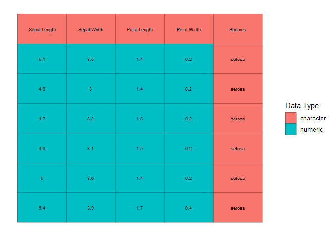
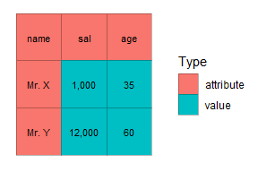
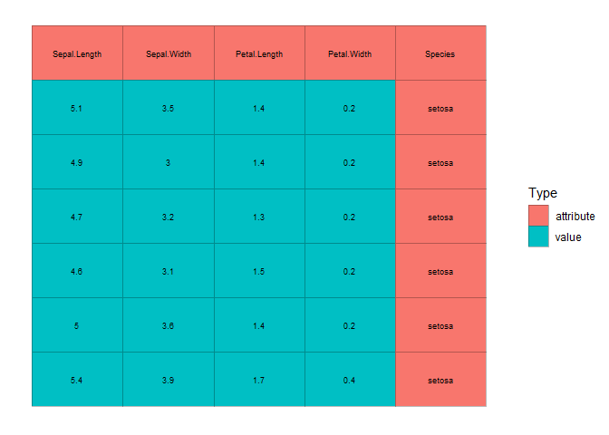
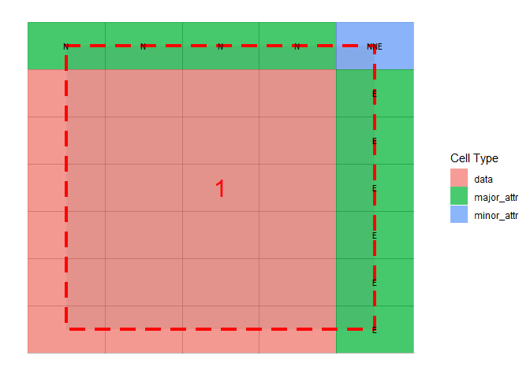
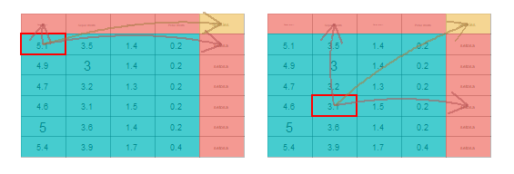

```{r, include = FALSE}
knitr::opts_chunk$set(
  collapse = TRUE,
  comment = "#>"
)
```

```{r setup, include = FALSE}
library(tidycells)
```

# **tidycells**
#### _Read Natural Tabular Data from Diverse Sources and Transform them into a Format Compatible to 'Tidyverse'_

<!-- badges: start -->
[](https://cran.r-project.org/package=tidycells)
[](https://travis-ci.org/r-rudra/tidycells)
[](https://ci.appveyor.com/project/bedantaguru/tidycells)
[](https://codecov.io/gh/r-rudra/tidycells?branch=master)
[](https://coveralls.io/r/r-rudra/tidycells?branch=master)
[](https://www.tidyverse.org/lifecycle/#maturing)
[](https://choosealicense.com/licenses/mit/)
<!-- badges: end -->

## Author

Indranil Gayen

## TL;DR
Given a `file_name` which is a path of a file that contains table(s). Run this `read_cells()` in the R-console to see whether support is present for the file type. If support is present, just run
```{r, eval=FALSE}
read_cells(file_name)
```
**Note** Just start with a small file.

## Introduction
The package provides utilities to read, cells from complex tabular data and heuristic detection based structural assignment of those cells to a columnar or tidy format. 
Read functionality has the ability to read (in a unified manner) structured, partially structured or unstructured tabular data (usually spreadsheets for public data dissemination and aimed for common human understanding) from various types of documents. The tabular information is read as cells.
The 'structure assignment' functionality has both supervised and unsupervised way of assigning cells data to columnar/tidy format. Multiple disconnected blocks of tables in a single sheet are also handled appropriately.
These tools are suitable for unattended conversation of (maybe a pile of) messy tables (like government data) into a consumable format(usable for further analysis and data wrangling).

## Inspiration
A spreadsheet is really flexible in storing and sharing data. Many organizations use excel files as their fundamental medium of data exchange (particularly in the government sector). These data are generally not in tidy format (thanks to ultra flexibility of spreadsheets!). This is a great time killer for R data scientist adopting [tidyverse](https://www.tidyverse.org/) techniques. A lot of time is spent to bring the data into a consumable or usable format ([tidy format](https://r4ds.had.co.nz/tidy-data.html)). For example, you may check out [Database of Indian Economy](https://dbie.rbi.org.in/) (a public data dissemination platform from [_Reserve Bank of India_](https://www.rbi.org.in/)). This platform is a great source of Indian economy data. However, since the target audience of this platform is possibly common people and not data scientists, the data structure is not suitable for ready consumption in _tidyverse_ functions. This is not only one, but there are plenty of great source of data which provides data in _"eye-relaxing"_ format rather than tidy format.
Thanks to great packages like [tidyr](https://github.com/tidyverse/tidyr), [tidyxl](https://github.com/nacnudus/tidyxl), [unpivotr](https://github.com/nacnudus/unpivotr) (and many other sweet packages mentioned in _reference_) which enable users to spend less time in reshaping the data and focus more on analysis rather than data wrangling.
These packages require user interaction and decision to transform and reshape the raw data (which is still easier than doing _copy-paste and transpose_ in excel) into the tidy format. 
What if, you are given a pile of excel (or any other format of spreadsheets) which are somehow similar but are generated by various human hands over a long period (obviously the format and structure will change from file to file). Or you want to build an automated forecast mechanism based on some spreadsheet which updates periodically (possibly you may get the updated file through some automated channel like web scraping, FTP transfer etc.). Or simply you want something like _"I'm Feeling Lucky"_!


## Installation
To install the development version from GitHub you'll need `devtools` package in R.
Assuming you have `devtools` you can install this package in R with the following command:
```{r, echo = TRUE, eval = FALSE}
devtools::install_github("r-rudra/tidycells")
```
## Getting Started
### 1. Reading Data
Assuming you have a document(in either csv, xls, xlsx, docx, doc, html or in pdf, _well not a scanned one_) which contains a table, read the file directly to a tidy format (let's refer the same as composed format) using `read_cells` like the following example:

```{r}
fold <- system.file("extdata", "messy", package = "tidycells", mustWork = TRUE)
# this is because extension is intentionally given wrong  
# while filename is actual identifier of the file type
fcsv <- list.files(fold, pattern = "^csv.", full.names = TRUE)[1]
read_cells(fcsv)
```
Not a big deal for csv though. Still let's see how the file actually looks like
```{r}
utils::read.csv(fcsv)
```


Note that `read_cells` is neutral to file extension which means if somehow .xls file is saved as .csv file, then also it will detect the underlying file correctly as xls and use appreciate function to read tabular information contained in the file.
However, support for each file types apart from csv is based on optional R packages. If you simply type `read_cells()` in the console, it will print which file types are supported and which package is potentially required for functionality, those are currently not available. If any package is potentially required, install the same and restart the R session to make that effective.
Here is a sample output:
```{r, eval=FALSE}
read_cells()
```

```{r, out.width = "550px", echo=FALSE}
knitr::include_graphics("vignettes/ext/read_cells_out.png")
```

Well, this is like "I'm feeling lucky" kind of thing. If the final result is not what you are looking for, you may have to do some bit of extra work.
The function `read_cells` has a few layers or stages of processing. You can choose the stage to stop processing and give intermediate results. Then you may manipulate the intermediate result, tune it and finally again resume processing.
`read_cells` can be broken into pieces like
```{r}
d1 <- read_cells(fcsv, at_level = "va_classify") %>% 
  read_cells()
d2 <- read_cells(fcsv, at_level = 2) %>% 
  read_cells(at_level = 4) %>% 
  read_cells()
identical(d1, d2)
```


Now to make you understand what you can do with intermediate results, let's explain to you other functionalities of the package.

### 2. Making Data _tidy_
If you have any R object `x`, you can call `as_cell_df` convert it into a `cell-df` format (the format to store cell by cell information. See the documentation of as_cell_df or cell_df-class for more details).

```{r}
x <- iris %>% head() 
cd <- x %>% as_cell_df(take_col_names = TRUE)
```

Each stored cell has an address specified by row and column and a value (converted to a string) and a possible data type. Thus the `cell_df` structure is defined. This is the first level of operations performed by `read_cells`.

You can even see how the data looks by issuing plot command.
```{r, eval=FALSE}
plot(cd, adaptive_txt_size = FALSE, txt_size = 2.5)
```
```{r, out.width = "356px", echo=FALSE}

```


Next task is to assign each cell into value, attribute (of those values) and empty (irrelevant information). This is referred to in the package as value/attribute classification (VA classification). There are main 4 alternative ways to do this apart from manually editing by hand. These are documented in `value_attribute_classify` function. 
For now, we'll use the most useful classifier, `numeric_values_classifier`. It assumes the cells which can be converted to a number, as values and rest as attributes. If the cell is storing a number as a string (remember the famous warning you may have seen in Excel about "Number Stored as Text") it will treat that as values.
Let's take a sample example
```{r}
dummy_dat <- tibble::tibble(name = c("Mr. X", "Mr. Y"), sal = c("1,000","12,000"), age = c(35, 60))
dummy_dat
dummy_dat_cells <- dummy_dat %>% 
  as_cell_df(take_col_names = TRUE) 
```
We can either do this 
```{r}
va_cells <- numeric_values_classifier(dummy_dat_cells)
```
Or this
```{r}
va_cells <- value_attribute_classify(dummy_dat_cells, 
                                     classifier = numeric_values_classifier())
```

Let's plot it
```{r, fig.width=3, fig.height=2, eval=FALSE}
plot(va_cells, adaptive_txt_size = FALSE, txt_size = 3)
```
```{r, out.width = "256px", echo=FALSE}

```


Once VA classification is done, if you plot the cells you'll notice the color scheme is now pointed at VA classification (which is given by `Type`) rather than cell types.
```{r, eval=FALSE}
# let's resume with iris example
cd <- numeric_values_classifier(cd)
plot(cd, adaptive_txt_size = FALSE, txt_size = 2.5)
```
```{r, out.width = "356px", echo=FALSE}

```
```{r, echo=FALSE}
cd <- numeric_values_classifier(cd)
```


After this stage now the `cell-df` is ready for analysis (to understand data blocks, the orientation of attributes with respect to data or values). This is done via the following command.
```{r}
ca <- analyze_cells(cd)
```

This takes a while (the time taken is largely dependent on the complexity of the underlying tabular structure). Once it's done you can plot the cell analysis and see how the heuristic detection has performed. Currently, only interactive way is developed for possible modifications in a cell analysis (covered in the subsequent section: _Interactive Modules_).
```{r, eval=FALSE}
plot(ca)
```
```{r, out.width = "356px", echo=FALSE}

```

Having a cell analysis at hand, the next process to perform is to compose this cell analysis to form a composed columnar format data.frame. This is easily done as
```{r}
compose_cells(ca)
```


After this, you may like to see how the final data is connected or rendered from the actual table. To do this you may run
```{r, fig.width=3, fig.height=2, eval=FALSE}
cell_composition_traceback(ca, trace_row = 1)
cell_composition_traceback(ca, trace_row = 10)
```
```{r, out.width = "356px", echo=FALSE}

```

There is an optional interactive version of it, which is explained in the subsequent section _Interactive Modules_.

That's all. These are the process flow followed by `read_cells` A half-done item can be further manipulated and after the same, we can give it back to `read_cells` again to finish further processing (or simply can do it ourselves). Here is a sample manipulation example.
```{r}
rc_part <- read_cells(fcsv, at_level = 2)
# it is a list with `read_cells_stage` attribute
# which indicate the last processed stage in read_cells
str(rc_part)
# sample_based_classifier is another VA classifier
# for details see coresponding documentation
rc_part[[1]] <- rc_part[[1]] %>% sample_based_classifier(empty_sample = "6")

# below should be similar to 
# rc_part[[1]] %>% 
#   analyze_cells() %>% 
#   compose_cells(discard_raw_cols = TRUE)
rc_part %>% read_cells(from_level = 3)
```


### 3. Support for Multiple Formats
When coming to support for multiple formats (assuming you have all the required packages as specified by `read_cells`) you can run following set of command to test the multi-format support in `read_cells`.
```{r}
dm <- tibble::tibble(fn = list.files(fold, full.names = T))
dcomps <- dm$fn %>% purrr::map(read_cells)
dcomps_sel <- dcomps %>%
    purrr::map(~ .x %>%
      dplyr::select(value, major_1, major_2))
# all of them are same [intentionaly made. but the file types are totally diffwrent]
dcomps_sel %>% purrr::map_lgl(~identical(.x, dcomps_sel[[1]]))
# check one sample
dcomps_sel[[1]]

```

Each file is with the wrong extension and the original extension should be the file name part before extension (intentionally created for testing this feature). Like for example, docx.csv is actually a docx. You can copy into some location where you have write access, then rename appropriately and open it to verify.

### 4. Interactive Modules
The package also provides shiny based interactive visualisations for understanding how the heuristic is functioning and also provides object (like `cell-df` or `cell-analysis`) editing capabilities. 

The [shiny](https://shiny.rstudio.com/) package is required for these functions. Most of the features are self-explanatory and guided. 
Check out interactive documentation of any of these functions listed below.
Here are screenshots of each interactive widgets. 

1. Plot tune (part of all modules)
2. `visual_crop()` for data crop and deletion of sections

```{r, out.width = "516px", echo=FALSE}
knitr::include_graphics("vignettes/ext/v12.png")
```

3. `visual_va_classify()` for interactive VA classification
4. `visual_data_block_inspection()` this shows how the heuristic has performed the analysis after `analyze_cells`

```{r, out.width = "516px", echo=FALSE}
knitr::include_graphics("vignettes/ext/v34.png")
```

5. `visual_orientation_modification()` for modification to heuristic based results
6. `visual_traceback()` this is for observing how the original data is composed to form the final output. (`compose_cells` is called internally)

```{r, out.width = "516px", echo=FALSE}
knitr::include_graphics("vignettes/ext/v56.png")
```

For each of these modules, there is a dynamic plot option available from [plotly](https://github.com/ropensci/plotly). If you have that package the corresponding tab will be activated. 
Since all of these modules are entirely optional the dependency is kept at **tidycells** 'suggests' level only. 

## Current State of Development and Way Forward
- [x] Put it on GitHub
- [ ] Test it in [r-hub](https://builder.r-hub.io/)
- [ ] Write more tests (increase coverage)
- [ ] Write more vignettes on other topics
- [ ] Adding codecov, travis-ci and other related badges (of course integration is required)
- [ ] Releasing this package to CRAN
- [ ] Making a pkgdown site
- [ ] Making cell analysis little faster
- [ ] Test for optional shiny modules (series of visual functions)


## Reference and Related Projects
* [tidyxl](https://github.com/nacnudus/tidyxl) :  **Read Untidy Excel Files:**
    Imports non-tabular from Excel files into R. Exposes cell content, position and formatting in a tidy structure for further manipulation. Tokenizes Excel formulas. Supports '.xlsx' and '.xlsm' via the embedded 'RapidXML' C++ library <http://rapidxml.sourceforge.net>. Does not support '.xlsb' or '.xls'.
* [unpivotr](https://github.com/nacnudus/unpivotr): **Unpivot Complex and Irregular Data Layouts**
    Tools for converting data from complex or irregular layouts to a columnar structure. For example, tables with multilevel column or row headers, or spreadsheets. Header and data cells are selected by their contents and position, as well as formatting and comments where available, and are associated with one other by their proximity in given directions. Functions for data frames and HTML tables are provided.
    Major parts of the package right now fully depend on **unpivotr**. The **tidycells** package would have never existed without this wonderful package from [Duncan Garmonsway](https://github.com/nacnudus).
* The [rsheets](https://github.com/rsheets) project: 
    It hosts several R packages (few of them are in CRAN already) which are in the early stages of importing spreadsheets from Excel and Google Sheets into R.  Specifically, have a look at these projects which seems closely related to these projects : [jailbreaker](https://github.com/rsheets/jailbreakr), [rexcel](https://github.com/rsheets/rexcel) (README of this project has a wonderful reference for excel integration with R).


## Acknowledgements
This package incomplete without following packages (apart from the **unpivotr** which is the core package on which **tidycells** dependes largely, as mentioned above ). Each of these packages are in suggests fields of `tidycells`.
(The read_cells basically, performs unification on several functions from various packages to give you support for different file types. These are listed below.)

* [**readr**](https://cran.r-project.org/package=readr): for csv (in melted format)
* [**readxl**](https://cran.r-project.org/package=readxl): for reading xls (if xlsx is present by default xlsx will be used for xls)
* [**xlsx**](https://cran.r-project.org/package=xlsx): for reading xls (also it has capabilities to read xlsx)
* [**tidyxl**](https://cran.r-project.org/package=tidyxl): really fast library for reading xlsx
* [**docxtractr**](https://cran.r-project.org/package=docxtractr) : for docx and doc (it has a system level dependency now)
* [**tabulizer**](https://cran.r-project.org/package=tabulizer) : for pdf
* [**XML**](https://cran.r-project.org/package=XML) : for html/xml type files

